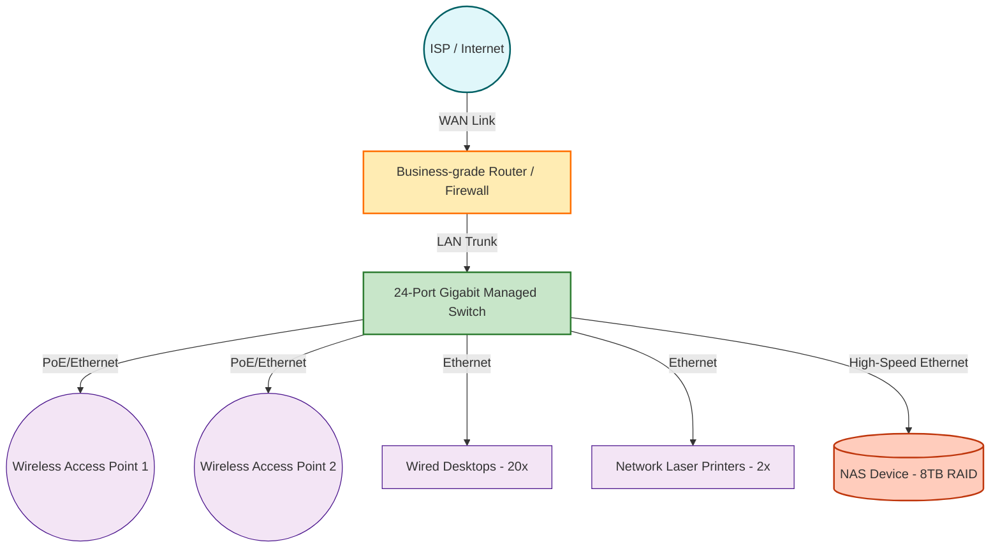

# Ubuntu Innovations (Pty) Ltd - Week 1 IT Infrastructure Documentation

## Deliverable 1: Business Requirements Analysis

**Executive Report: IT Infrastructure Requirements**

**Company Overview**
Ubuntu Innovations (Pty) Ltd is a rapidly growing technology startup based in Cape Town. As part of an ongoing expansion, the company is relocating to a new office space. To support business continuity, security, and scalable growth, a robust and modernized IT infrastructure must be designed and implemented to meet the specific operational demands of the organization.

**Department Breakdown**
The organization currently consists of 25 employees structured across five distinct departments:
* **Executive Management:** 3 Employees
* **Finance:** 4 Employees
* **Human Resources (HR):** 3 Employees
* **Sales and Marketing:** 7 Employees
* **Software Development:** 8 Employees

**Operational Needs**
To ensure productivity and secure operations, the following core IT requirements have been identified:
1. **Secure Wired & Wireless Connectivity:** Reliable, high-speed wired connections for stationary workstations (Desktops) and widespread, secure Wi-Fi 6 coverage for mobile devices and laptops.
2. **Shared Storage:** Centralized, highly available storage solutions to facilitate collaboration across departments.
3. **Shared Printers:** Strategically deployed network printers accessible by all departments for physical document processing.
4. **Department-Based Access Control:** Role-Based Access Control (RBAC) to ensure employees only have access to the data, network segments, and resources pertinent to their departmental functions (e.g., restricting financial records to the Finance department).
5. **Data Backup:** Automated, redundant data backup protocols to protect against data loss and ensure rapid disaster recovery.

---

## Deliverable 2: Hardware Inventory Table

| Asset | Quantity | Suggested Specification | Business Justification |
| :--- | :---: | :--- | :--- |
| **Desktop Computers** | 20 | Intel Core i5, 16GB RAM, 512GB SSD | Standard workstations providing sufficient processing power for daily administrative, finance, HR, and marketing operations. |
| **Laptops** | 5 | Intel Core i7, 16GB RAM, 512GB/1TB SSD | High-performance mobility for Executive Management and specific developer or sales roles requiring portability. |
| **Router** | 1 | Business-grade firewall router | Acts as the primary gateway, providing secure internet access, VPN capabilities, and robust threat protection. |
| **Switch** | 1 | 24-port Gigabit managed switch | Enables high-speed, reliable wired local area network (LAN) connectivity and VLAN segmentation for the office. |
| **Wireless Access Points** | 2 | Dual-band Wi-Fi 6 | Ensures fast, seamless wireless coverage across the new office space without dead zones. |
| **Network Printers** | 2 | High-volume Laser printers | Provides shared, cost-effective, and fast physical document production for all departments. |
| **NAS Device** | 1 | 8TB RAID storage | Centralized, redundant network-attached storage for departmental file sharing and local data backups. |
| **UPS** | 2 | 1500VA | Uninterruptible Power Supply to protect critical infrastructure (Router, Switch, NAS) from power surges and outages, typical during load shedding. |

---

## Deliverable 3: Software Inventory and Licensing Plan

### 1. Standard Company-Wide Software
* **Operating System:** Windows 11 Pro (Ensures enterprise management and BitLocker encryption).
* **Productivity Suite:** Microsoft 365 Business Standard (Includes Outlook, Word, Excel, Teams, and SharePoint for collaboration).
* **Security & EDR:** CrowdStrike Falcon or Microsoft Defender for Endpoint (Next-generation antivirus and Endpoint Detection & Response).
* **Cloud Backup:** Microsoft OneDrive / Azure Backup (Continuous data protection for endpoints).

### 2. Department-Specific Software
* **Executive Management:** Microsoft Power BI Pro (For high-level business analytics and reporting).
* **Finance:** Sage 50cloud / Xero Accounting & Payroll (Financial management software).
* **Human Resources:** BambooHR or similar HRIS (Human Resources Information System).
* **Sales and Marketing:** Salesforce CRM, Adobe Creative Cloud (For graphic design and marketing collateral).
* **Software Development:** JetBrains IDEs (IntelliJ, WebStorm, etc.), Visual Studio, Docker Desktop, Git/GitHub Enterprise, AWS/Azure CLI.

---

## Deliverable 4: Network Architecture Diagram

---

## Deliverable 5: Helpdesk Troubleshooting Log

### Scenario 1: Desktop Not Powering On
* **Problem Description:** User reports that their desktop computer is completely unresponsive and will not turn on when the power button is pressed.
* **Symptoms:** No indicator lights on the desktop chassis, no fan noise, monitors display "No Signal."
* **Possible Causes:** Disconnected power cable, faulty power strip/UPS, dead power supply unit (PSU), or motherboard failure.
* **Troubleshooting Steps:**
    1. Verify the power cable is securely connected to both the back of the PC and the wall outlet/UPS.
    2. Check if the UPS or power strip is turned on and supplying power to other devices (e.g., monitor).
    3. Bypass the power strip by plugging the PC directly into a known working wall outlet.
    4. Perform a "power drain" by unplugging the PC, holding the power button for 30 seconds, plugging it back in, and attempting to turn it on.
* **Resolution:** Swapped out a faulty power cable with a new one. The desktop successfully powered on and booted into the OS.

### Scenario 2: No Internet Connectivity
* **Problem Description:** A user from the Sales department cannot access external websites or cloud services.
* **Symptoms:** Browser displays "No Internet" error; a yellow warning triangle appears over the network icon in the Windows taskbar.
* **Possible Causes:** Disconnected Ethernet cable, IP address conflict, disabled network adapter, or a broader switch/ISP outage.
* **Troubleshooting Steps:**
    1. Check the physical Ethernet cable connection at both the PC and the wall port.
    2. Verify if other users in the department are experiencing the same issue (isolate single user vs. network-wide issue).
    3. Open Command Prompt and run `ipconfig`. Check if the user is receiving a valid IP address or an APIPA (169.254.x.x) address.
    4. Run `ping 8.8.8.8` to test external connectivity, and `ping [Gateway IP]` to test local router connectivity.
    5. Run the Windows Network Troubleshooter to reset the network adapter.
* **Resolution:** Discovered the user's Ethernet cable was loosely connected. Reseated the RJ45 connector, at which point the link light activated, and internet access was immediately restored.

### Scenario 3: Printer Offline
* **Problem Description:** The Finance department is unable to print end-of-month reports; the designated network printer shows as "Offline."
* **Symptoms:** Print jobs are stuck in the queue. The printer status in Windows says "Offline."
* **Possible Causes:** Printer is powered off or in deep sleep, network cable disconnected from the printer, IP address of the printer changed (DHCP issue), or a paper jam/error state.
* **Troubleshooting Steps:**
    1. Physically inspect the printer to ensure it is powered on, awake, and not displaying any error codes (e.g., low toner or paper jam).
    2. Check the network cable connecting the printer to the wall port.
    3. From a PC, attempt to ping the static IP address of the printer.
    4. Access the printer's IP address via a web browser to check the internal administrative status.
    5. Restart the Print Spooler service on the affected user's PC (`services.msc` -> Print Spooler -> Restart).
* **Resolution:** The printer had fallen off the network due to an IP address conflict. Reserved a static IP for the printer in the router's DHCP settings, restarted the printer, and successfully cleared the print queue.
